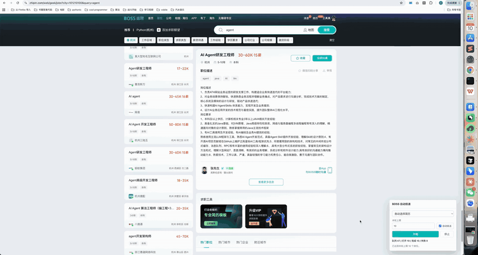

# BOSS Agent Greeting Assistant

一个本地求职辅助小工具：当你在浏览器中打开 BOSS 直聘岗位详情页时，Chrome 扩展读取页面上已经渲染出来的职位描述，发送给本地 FastAPI 服务；服务端结合本地简历和 DeepSeek 生成 200 字以内的打招呼内容。



[查看完整演示视频](docs/assets/demo.mp4)

## 设计边界

- 不做独立爬虫，不主动攻克 BOSS 反爬。
- 依赖你本地浏览器已经能正常打开岗位详情页。
- 简历和 DeepSeek API key 只在本机后端使用，不放进浏览器扩展。

## 项目结构

```text
.
├── app/
│   ├── main.py          # FastAPI 入口
│   ├── llm.py           # DeepSeek OpenAI-compatible 调用
│   ├── prompt.py        # 生成提示词
│   ├── resume_store.py  # 简历读取与自动选择
│   └── schemas.py       # API schema
├── extension/
│   ├── manifest.json    # Chrome 扩展配置
│   ├── content.js       # 页面抽取与面板 UI
│   └── styles.css       # 面板样式
└── requirements.txt
```

## 启动本地服务

```bash
python3 -m venv .venv
source .venv/bin/activate
pip install -r requirements.txt
uvicorn app.main:app --host 127.0.0.1 --port 8765 --reload
```

服务会从环境变量读取 DeepSeek key，支持下面任意一个变量名：

```bash
deepseek_key
DEEPSEEK_API_KEY
DEEPSEEK_KEY
```

默认简历路径：

```text
resumes/agent-resume.md
resumes/fde-resume.md
```

如果后续移动文件，可以用环境变量覆盖：

```bash
export BOSS_AGENT_RESUME_AGENT_PATH="/path/to/agent-resume.md"
export BOSS_AGENT_RESUME_FDE_PATH="/path/to/fde-resume.md"
```

健康检查：

```bash
curl http://127.0.0.1:8765/api/health
```

## 安装 Chrome 扩展

1. 打开 Chrome: `chrome://extensions/`
2. 打开右上角「开发者模式」
3. 点击「加载已解压的扩展程序」
4. 选择本项目的 `extension` 目录
5. 打开 BOSS 直聘岗位详情页，右下角会出现生成面板

## 使用方式

1. 确认本地服务已启动。
2. 在 Chrome 中正常登录并打开岗位详情页。
3. 在右下角面板选择简历倾向，默认「自动」。
4. 点击「生成招呼」可生成 200 字以内打招呼内容。
5. 点击「润色简历」可基于当前岗位生成一份本地 Markdown 简历。
6. 结果出来后点击复制，粘贴到 BOSS 沟通框或打开生成的本地文件。

润色后的简历默认保存到：

```text
generated_resumes/
```

如果要改保存目录，可以设置：

```bash
export BOSS_AGENT_OUTPUT_DIR="/path/to/generated-resumes"
```

## API

### `POST /api/greeting`

请求：

```json
{
  "job_title": "Agent 开发工程师",
  "company": "某公司",
  "description": "岗位职责...",
  "resume_profile": "auto"
}
```

### `POST /api/resume-polish`

请求字段与 `/api/greeting` 相同。

响应：

```json
{
  "markdown": "# 候选人姓名...",
  "file_path": "generated_resumes/20260706-140000-agent-company-job.md",
  "resume_profile": "agent",
  "model": "deepseek-chat"
}
```

`resume_profile` 可选：`auto`、`agent`、`fde`。

响应：

```json
{
  "greeting": "您好，我是候选人姓名...",
  "resume_profile": "agent",
  "model": "deepseek-chat"
}
```
